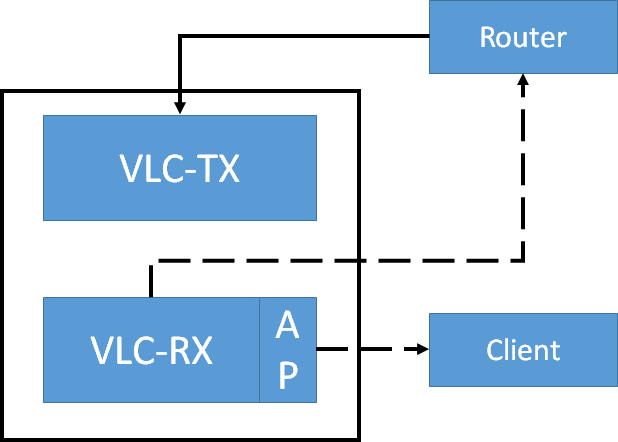

## CSDS VLC TCP

Code for running TCP link over VLC-RF hybrid link.

### Platform

NI Chasis + NI USRP-2953R + NI FlexRIO-5782; Windows7 only.

### Instruction

1. Program Assembly

   a. Install `Python 2.7.x` and `pip` in system environment virable;

   b. Run `Setup.by` to install python dependencies;

   c.  Copy `Tx side/simple-mac` and `Rx side/simple-mac` to the VLC CSDS projct of corresponding host; and copy `Tx Side/VLC_TX` and `Rx Side/VLC_RX` to the corresponding host together;

   d. Configure `VLC_TX/config.json` : 

   ​	`cap_iface` , for downlink interface capture from router;

   ​	`ip_range` , allocated IP address for clients, adjust according to router mask;

   ​     Configure `VLC_RX/config.json` : 

   ​	`reg_id, reg_server` , receiver id + transmitter ip over wireless interface;

   ​	`iface_back` , uplink interface to router;

   ​	`iface_front` , downlink interface to client as  

   > P.S. you sould staticly bind those IP address to your VLC Tx wireless NIC, or carry out [ARP Spoof](http://www.secdev.org/projects/scapy/demo.html).
   >
   > P.S.S. run `python test.py` to find out your (network interface name, interface Index, IP Address)

2. System Network Setup

   

   ​				(*dash line* for `Wi-Fi` wireless link, *concrete line* for `Ethernet` wired link)

   The difficult part existing in setup desired ***hosted network*** on VLC Rx:

   ​	a. Pull out `ethernet link + USB dongles`, before Windows boots up;

   ​	b. Plug in the `front-end USB dongle` , and setup hostednetowork on it: (**NO** association)

   ​		i. `netsh wlan set hostednetwork mode=allow ssid=<SSID> key=<Password>`

   ​		ii. `netsh wlan start hostednetwork`

   ​	c. Plug in the `back-end USB dongle` , and associate with the **Router**;

   ​	d. share this connection with the *virtual hostednetwork* in `Windows Network Connections` panel

3. System Running Setup

   ```markdown
   iperf passthrough test: (connect server to the **WAN port** on router)
   		on Server: `iperf3 -s`
   		on Client: `iperf3 -c <server_ip> -R -t 60 -O 10`
   ```

   a. Bare Wi-Fi Relay ( Router <\=\=> VLC_RX <\=\=> Client)

   ​	No need running any program;

   b. Wired Relay (Router <\=\=> VLC_TX \-\-> VLC_RX <\=\=> Client)

   ​	`python tx-capture-daemon` in `VLC_TX` ;

   ​	`python rx-switch-daemon` in `VLC_RX`, with `"upd_port":10086` in `VLC_RX\config.json` ;

   c. VLC Relay (Router <\=\=> VLC_TX \=\=> VLC_RX <\=\=> Client)

   ​	Running python program firstly, with `"upd_port":12306` in `VLC_RX\config.json` ;

   ​	Then running CSDS program;

   > P.S. run python programm as **Administrator**; user `cmder` to have better experience.

### Scenario

1. Same-Cell Interference

   (tbd.)

2. Inter-Cell Interference

   (tbd.)